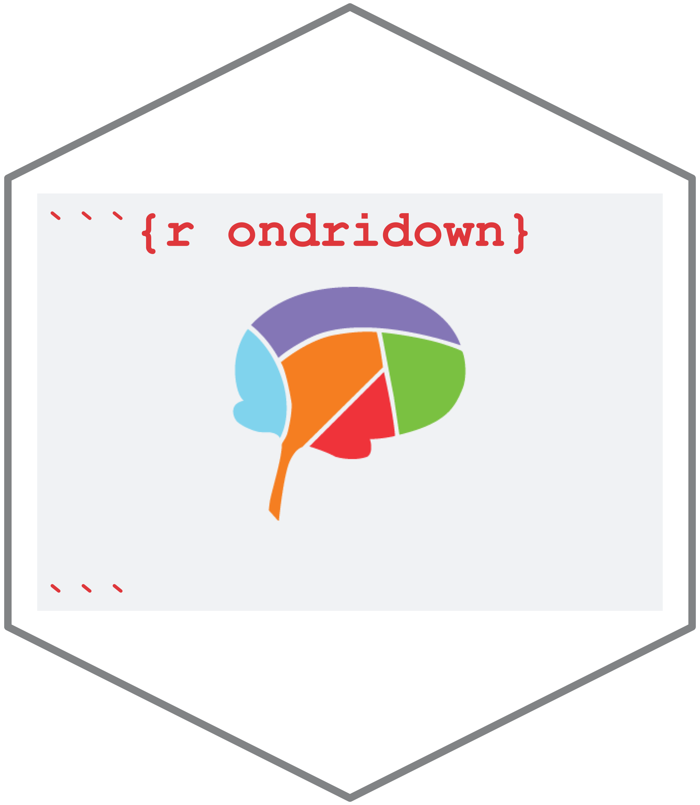
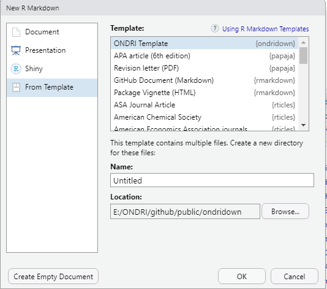

```{r setup, include=FALSE}
knitr::opts_chunk$set(echo = TRUE)
```

# ONDRIdown 

The `ONDRIdown` package is an R package for creating ONDRI documentation using a standardized RMarkdown template. <b>This package is currently under development.</b><br><br>

Class files (for APA style citations) are from [Citation Style Language's GitHub page](https://github.com/citation-style-language/styles/blob/master/apa.csl). Much of the inspiration and basis of the template comes from [bookdown](https://bookdown.org/yihui/rmarkdown/).

<br>

* Install [R](https://cran.r-project.org/) first and then [RStudio](https://rstudio.com/products/rstudio/download/). Please choose the correct installer carefully as it will depend on your computer's operating system.

<br>

* Download and install the template directly with the following lines of code:
```
  if (!require("devtools")){
    install.packages("devtools")
  }
  devtools::install_github(repo = "ondri-nibs/ondridown")
```
If you get the following message in your RStudio console, please type 3.
<br><br>


<br>

* Install the following R packages if you haven't already. Please type 3 again if you get the message above.
```
install.packages("knitr")
install.packages("ggplot2")
install.packages("bookdown")
install.packages("tinytex")
tinytex::install_tinytex()
```

<br>

When installation is complete, please exit your RStudio and then reopen it. Go to ```File -> New File -> RMarkdown... -> From Template```. You will see the window below.<br><br>
<kbd>
  
</kbd>
<br><br>

Please select "ONDRI Template" to generate a directory with the RMarkdown template file and its dependencies.
