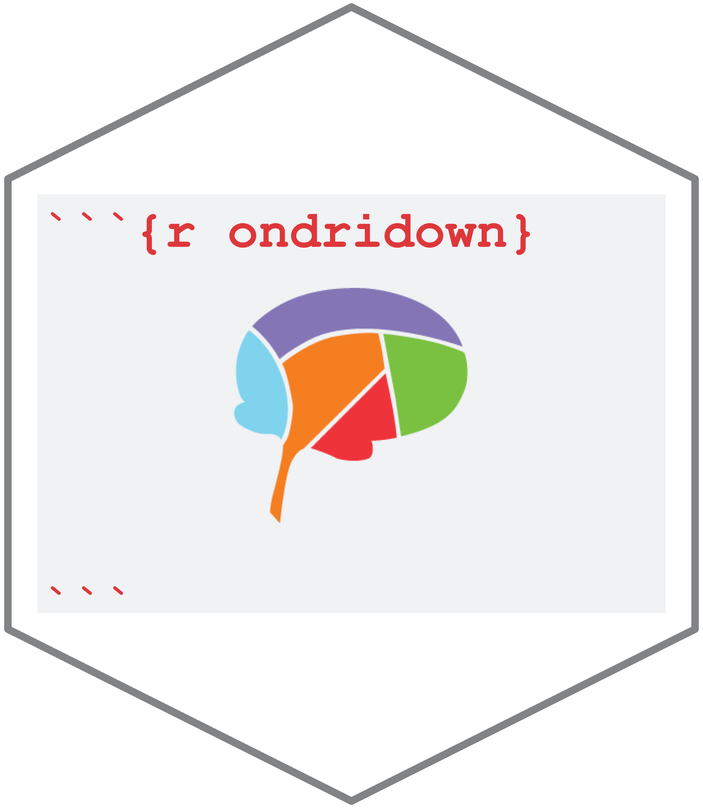
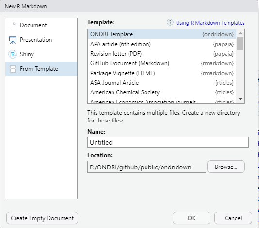

# README

Jedid Ahn & Derek Beaton, 2020SEP24

# ondridown 


The `ondridown` package is an R package for creating ONDRI documentation using a standardized RMarkdown template. <b>This package is currently under development.</b><br><br>

Class files (for APA style citations) are from [Citation Style Language's github page](https://github.com/citation-style-language/styles/blob/master/apa.csl). Much of the inspiration and basis of the template comes from [bookdown](https://bookdown.org/yihui/rmarkdown/).


To use this package, please clone the repository and open the project through ```ondridown.Rproj```. Once you've opened the project, please install it using the following lines of code.
```
if (!require(devtools)){
    install.packages(devtools)
}
devtools::install()
```

Alternatively, you can use `devtools` to download and install directly, e.g.,

```
if(!require('devtools')){
  devtools::install_github(repo = "ondri-nibs/ondridown")
}
```

<br>

In addition, please install the following R packages if you haven't already.
```
install.packages("knitr")
install.packages("ggplot2")
install.packages("bookdown")
install.packages("tinytex")
tinytex::install_tinytex()
```

<br>

Once installation is complete, please exit your RStudio and then reopen it. Go to ```File -> New File -> RMarkdown... -> From Template```. You will see the window below.<br><br>
<kbd>
  
</kbd>
<br><br>

Please select "ONDRI Template" to generate a directory with the RMarkdown template file and its dependencies.

