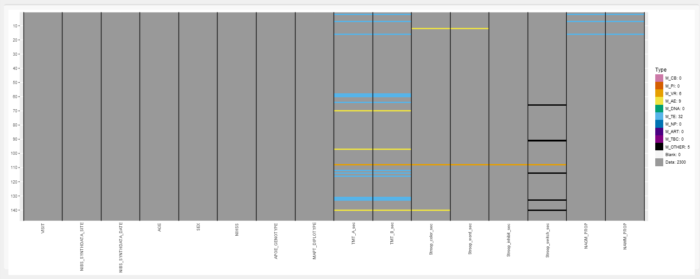

```{r include=FALSE}
# Libraries to load here.
library(knitr)
library(ggplot2)
```

---
header-includes:
- \usepackage{titling}
- \pretitle{\begin{center}\vspace{-1.3cm}\LARGE\includegraphics[width=5cm]{ONDRI.png}\\[\bigskipamount]\hfill\break}
- \posttitle{\end{center}}
- \preauthor{\begin{center} \vspace{0.3cm}}
- \postauthor{\vspace{0.3cm} \end{center}}
- \predate{\begin{center}}
- \postdate{\\[\bigskipamount] \vspace{0.3cm} \hrulefill \end{center} \vspace{0.6cm} `r params$description`}
title: `r params$title`
author: `r params$author`
date: `r params$date`
documentclass: article
fontsize: 10pt
geometry: margin=2.54cm
---

\pagebreak

# Title 1

## Subtitle

## Ordinary Text
Lorem ipsum dolor sit amet, consectetur adipiscing elit, sed do eiusmod tempor incididunt ut labore et dolore magna aliqua. Ut enim ad minim veniam, quis nostrud exercitation ullamco laboris nisi ut aliquip ex ea commodo consequat. Duis aute irure dolor in reprehenderit in voluptate velit esse cillum dolore eu fugiat nulla pariatur. Excepteur sint occaecat cupidatat non proident, sunt in culpa qui officia deserunt mollit anim id est laborum.

## Indented Text
|   Lorem ipsum dolor sit amet, consectetur adipiscing elit, sed do eiusmod tempor incididunt ut labore et dolore magna aliqua. Ut enim ad minim veniam, quis nostrud exercitation ullamco laboris nisi ut aliquip ex ea commodo consequat. Duis aute irure dolor in reprehenderit in voluptate velit esse cillum dolore eu fugiat nulla pariatur. Excepteur sint occaecat cupidatat non proident, sunt in culpa qui officia deserunt mollit anim id est laborum.

## Bold Text
**Lorem ipsum dolor sit amet, consectetur adipiscing elit, sed do eiusmod tempor incididunt ut labore et dolore magna aliqua. Ut enim ad minim veniam, quis nostrud exercitation ullamco laboris nisi ut aliquip ex ea commodo consequat. Duis aute irure dolor in reprehenderit in voluptate velit esse cillum dolore eu fugiat nulla pariatur. Excepteur sint occaecat cupidatat non proident, sunt in culpa qui officia deserunt mollit anim id est laborum.**

## Italic Text
*Lorem ipsum dolor sit amet, consectetur adipiscing elit, sed do eiusmod tempor incididunt ut labore et dolore magna aliqua. Ut enim ad minim veniam, quis nostrud exercitation ullamco laboris nisi ut aliquip ex ea commodo consequat. Duis aute irure dolor in reprehenderit in voluptate velit esse cillum dolore eu fugiat nulla pariatur. Excepteur sint occaecat cupidatat non proident, sunt in culpa qui officia deserunt mollit anim id est laborum.*

# Unordered List
* [ITEM 1]
* [ITEM 2]
    + [ITEM 2A]
    + [ITEM 2B]

## Ordered List
1. [ITEM 1]
2. [ITEM 2]
    + [ITEM 2A]
    + [ITEM 2B]

## Hyperlink
[TEXT HERE](https://google.ca) <!-- Add a new line. --> \newline

# Title 2
## Code chunk without evaluation.
```{r eval=FALSE}
install.packages("shiny")
install.packages("tidyverse")
```

## Code chunk with evaluation and printing.
```{r}
a <- 1
b <- 2
a + b
```

## Inline R code.
There are `r a + b` ONDRI Apps.

## Figure output.
```{r echo=FALSE,error=FALSE,out.width="100%",fig.cap="[CAPTION HERE]"}
ggplot(cars, aes(speed, dist)) + geom_point()
```

<!-- Page break: Subsequent content will be on the following page. -->
\pagebreak

## External image output.
```{r echo=FALSE,error=FALSE,out.width="100%",fig.cap="[CAPTION HERE]"}

```

<!-- Add spacing between subsections. -->
\vspace{0.4cm}

## Default table output.
```{r echo=FALSE,error=FALSE}
knitr::kable(head(mtcars[, 1:4]), format = "pandoc", caption = "[CAPTION HERE]")
```

# Math expressions
## Inline
<!-- Pair of dollar signs.  -->
Lorem ipsum dolor sit amet, consectetur adipiscing elit, sed do eiusmod tempor incididunt ut labore et dolore magna aliqua: $\sum_{i=1}^n X_i$

## Standalone
<!-- Double pair of dollar signs.  -->
$$\sum_{i=1}^n X_i$$

## Greek Letters
$$\alpha, \beta,  \gamma, \Gamma$$

## Aligning equations.
\begin{align}
    3+x &=4\\
    x &=4-3\\
    x &=1
\end{align}

## Aligning equations with comments.
\begin{align}
    3+x &=4 && \text{(Solve for } x \text{.)}\\
    x &=4-3 && \text{(Subtract 3 from both sides.)}\\
    x &=1   && \text{(Yielding the solution.)}
\end{align}


# In-text citations (APA format)
<!-- @ symbol.  -->
Lorem ipsum dolor sit amet, consectetur adipiscing elit, sed do eiusmod tempor incididunt ut labore et dolore magna aliqua. @item1 Ut enim ad minim veniam, quis nostrud exercitation ullamco laboris nisi ut aliquip ex ea commodo consequat. @item2 Duis aute irure dolor in reprehenderit in voluptate velit esse cillum dolore eu fugiat nulla pariatur. Excepteur sint occaecat cupidatat non proident, sunt in culpa qui officia deserunt mollit anim id est laborum. @item3

# References
<!-- The div will add references to this section. To add or modify references, please go to references.bib file. -->
<div id="refs"></div>

# (APPENDIX) Appendix {-} 

# Appendix A
Information here...

# Appendix B
More information here...

<!-- END -->